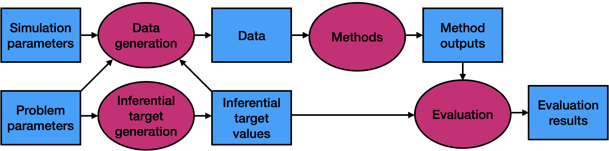

<!-- README.md is generated from README.Rmd. Please edit that file -->

# `simulatr`: Portable and scalable numerical simulations

Simulation studies play a crucial role in the development and assessment
of statistical methods. However, writing portable and scalable
simulation code is challenging. With the help of
[Nextflow](https://nextflow.io/), `simulatr` decouples the
*specification* of a simulation from the *execution* of a simulation,
enabling users to develop a simulation study on their laptop and then
seamlessly run the simulation at-scale on a distributed computing
platform like a high-performance computing cluster or cloud computing
service.

**Note**: This package is experimental and under active development. Use
with caution.

## Installation

You can install the development version from
[GitHub](https://github.com/) with:

    # install.packages("devtools")
    devtools::install_github("katsevich-lab/simulatr")

## Acknowledgment

We thank Jacob Bien for developing the [`simulator`
package](https://jacobbien.github.io/simulator/), which served as an
inspiration for `simulatr`. The primary difference is that `simulatr` is
specifically designed for seamless scaling via distributed computing
platforms.
