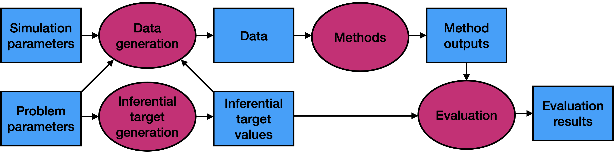

```{r, include = FALSE}
knitr::opts_chunk$set(
  collapse = TRUE,
  cache = TRUE,
  comment = "#>"
)
```

# The conceptual structure of a numerical simulation

The goal of a numerical simulation is to evaluate the performance of one or more statistical methods on data generated from one or more data-generating distributions. 

- **Problem parameters and inferential targets.** Each data-generating distribution is indexed by a number of *problem parameters*, e.g. the sample size or dimension of the problem, collectively called a *problem setting*. The problem parameters give rise to ground truth values of *inferential targets*, e.g. coefficients in a regression. The mapping between problem parameters and ground truth inferential target values, *inferential target generation*, may be either deterministic or randomized. 

- **Data generation.** The problem parameters and inferential target values give rise to a data-generating distribution. These, together with *simulation parameters* (e.g. the number of Monte Carlo realizations `B` to generate) are plugged into the *data generation* function to get data realizations for each data-generating distribution. 

- **Method application.** Each of the *methods* functions is applied to each realization of each data-generating distribution to give a number of *method outputs*. These outputs should include values for each inferential target (e.g. coefficient estimates). 

- **Method evaluation.** Then, one or more *evaluation functions* take as input the ground truth inferential target values and method outputs and compute some metric of inferential accuracy (e.g. root-mean-squared error). These *evaluation results* for each method and each problem setting, averaged over `B` Monte Carlo realizations, are the final output of the simulation study.

```{r, echo = FALSE, out.width = '100%'}

```

# `simulatr` specifier objects

In `simulatr`, the aforementioned components are all captured by a *`simulatr` specifier object*. This object has five fields, which are described below:

- `parameter_grid`: A data frame whose rows correspond to problem settings and whose columns are problem parameters. Additionally, the `parameter_grid` contains a special column called `ground_truth`, which contains an object of ground truth inferential target values for each problem setting (implemented as a [list-column](https://r4ds.hadley.nz/rectangling.html#list-columns)).
- `fixed_parameters`: An object whose fields are either simulation parameters or problem parameters common to all problem setting. This object must contain at least the fields `B`, the number of data realizations to generate per problem setting, and `seed`, the seed to set prior to the generation of data for each problem setting and prior to the application of each method.
- `generate_data_function`: A function that takes as input the problem parameters and ground truth inferential target values and outputs either (1) one data set or (2) `B` data sets. The latter option is useful in cases where all data sets are faster to generate together rather than one at a time.
- `run_method_functions`: A named list of *method functions*. A method function takes as input either (1) one data set or (2) `B` data sets. In case (1), the function outputs an object that contains fields with names corresponding to the inferential targets. In case (2), the function outputs a data frame with two columns: one column named `run_id` corresponding to the Monte Carlo replicate and one list-column named `output` containing the objects outputted for each replicate.
- `evaluation_functions`: A named list of *evaluation functions*. An evaluation function takes as input two objects: the ground truth inferential targets and the outputs from a method function. It outputs the value of an evaluation metric.

# `simulatr` workflow

1. **Assemble simulation components.** First, assemble the five objects described in the previous section.

2. **Create a `simulatr` specifier object.** Given the four simulation components, create a `simulatr` specifier object using the `simulatr_specifier()` function:
    ```{r, eval = FALSE}
    simulatr_spec <- simulatr_specifier(
      parameter_grid,
      fixed_parameters,
      generate_data_function, 
      run_method_functions,
      evaluation_functions
    )
    ```

3. **Check and, if necessary, update the `simulatr` specifier object.** Make sure that all parts of your `simulatr` specifier object are working by running a small portion of your simulation via the `check_simulatr_specifier_object()` function. This function takes as arguments the `simulatr` specifier object (`simulatr_spec`) as well as the number of data realizations to try (`B_in`). For checking purposes, you can use a small number for `B_in` like 2 or 3.
    ```{r, eval = FALSE}
    check_results <- check_simulatr_specifier_object(simulatr_spec, B_in = 3)
    ```
If there are any errors, `simulatr` will give informative error messages that will let you know which method and which parameter setting caused the problem, along with the corresponding data realization. Update the `simulatr` specifier object to fix any issues.

4. **Run the simulation.** There are two options for running a numerical simulation with `simulatr`. You can run `simulatr` either (1) [on your laptop](https://katsevich-lab.github.io/simulatr/articles/example-local.html), if your simulation is small or (2) [on a distributed computing platform](https://katsevich-lab.github.io/simulatr/articles/example-remote.html), if your simulation is large.

5. **Summarize and / or visualize the results.** The `simulatr` output will give you the value of each evaluation metric on each method on each problem setting. You can then create tables or graphs of these results.